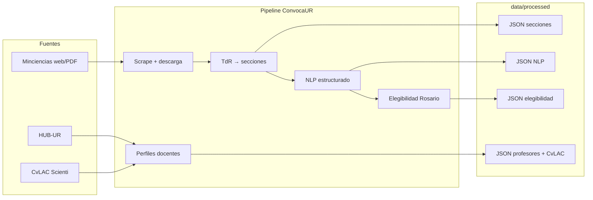

# ConvocaUR

Sistema de **ingesta → estructuración → NLP → elegibilidad** para convocatorias de Minciencias, cruzado con la capacidad investigativa de la **Universidad del Rosario**.

> Carpeta limpia del proyecto: solo lo necesario para operar el pipeline y consumir sus salidas.

Antes de usar NLP, copia `.env.example` → `.env` y pega tu `OPENROUTER_API_KEY`
(o reutiliza el `.env` de la raíz del monorepo; el cliente también lo busca como fallback).

---

## Qué resuelve

1. Bajar y organizar convocatorias, TdR y anexos de Minciencias.
2. Partir TdR por secciones y extraer campos tipados (LLM vía OpenRouter).
3. Decidir si Rosario (IES) puede postularse y en qué modo.
4. Hacer **match** de docentes (HUB-UR + CvLAC) con convocatorias (embeddings + TF-IDF + UI).

La vía **SECOP** del reto (tendencias, mercado, predicción) vive en
`laboratorio/datasecopexplora/`. Cómo se conectan ambas: [`docs/del_reto_a_mvp.md`](docs/del_reto_a_mvp.md).

---

## Mapa rápido



---

## Estructura del proyecto

```text
convocaur/
├── README.md                 ← estás aquí
├── requirements.txt
├── .env.example
├── .gitignore
├── config/                   ← parámetros no secretos
├── docs/                     ← guías + diagramas
├── scripts/                  ← comandos de punta a punta
├── src/convocaur/            ← código
│   ├── paths.py
│   ├── minciencias/
│   ├── urosario/
│   └── nlp/
└── data/
    ├── raw/                  ← tal cual llega
    └── processed/            ← listo para análisis / modelos
```

Detalle de cada carpeta de datos: [`docs/datos.md`](docs/datos.md).

---

## Documentación

| Doc | Contenido |
|-----|-----------|
| [Del reto al MVP](docs/del_reto_a_mvp.md) | SECOP (3 capacidades) → por qué Minciencias → matching docentes |
| [Arquitectura](docs/arquitectura.md) | Capas, límites, qué SÍ / NO hace el sistema |
| [Pipeline Minciencias](docs/pipeline_minciencias.md) | Scrape → archivos → TdR → secciones |
| [Capacidad Rosario](docs/capacidad_urosario.md) | Docentes HUB + enriquecimiento CvLAC |
| [NLP y elegibilidad](docs/nlp_y_elegibilidad.md) | OpenRouter, schemas, veredicto IES |
| [Datos](docs/datos.md) | Dónde vive cada archivo de entrada/salida |
| [Roadmap matching](docs/roadmap_matching.md) | Evolución embeddings / RAG |
| [Laboratorio](laboratorio/README.md) | Trabajo en paralelo por persona (tests / análisis) |
| [Catálogo datos lab](laboratorio/catalogo_datos.md) | Rutas CSV/JSON para análisis |
| [UI matching José](laboratorio/jose/web/README.md) | FastAPI + grafo de match |

---

## Arranque rápido

```bash
cd convocaur
python -m venv .venv
# Windows:
.venv\Scripts\activate
pip install -r requirements.txt

# Copiar secretos
copy .env.example .env
# editar OPENROUTER_API_KEY

# Hacer visible el paquete
set PYTHONPATH=src
```

Ejemplos:

```bash
# NLP + elegibilidad sobre convocatorias piloto
python scripts/run_nlp_piloto.py --convocatorias 48,45,976

# Solo re-evaluar elegibilidad Rosario
python scripts/run_elegibilidad.py --convocatorias 48,45,976
```

---

## Estado actual de datos (piloto)

| Activo | Cantidad aprox. |
|--------|-----------------|
| Convocatorias scrapeadas | ~15 |
| TdR coleccionados | 15 |
| Secciones / NLP / elegibilidad | 48, 45, 976 (piloto) |
| Docentes HUB | 613 CSV / 612 JSON |
| Con bloque CvLAC | 353 |
| Sin URL CvLAC | 259 (`sin_cvlac.csv`) |

---

## Principio de diseño

- **Raw** = sin limpiar, reproducible.
- **Processed** = tipado, comparable, auditable.
- **LLM** = extracción y juicio, no predicción final de mercado.
- **SECOP** (3 capacidades de mercado) se analiza en
  `laboratorio/datasecopexplora/`; este paquete se centra en
  **CTeI Minciencias ↔ Rosario** (MVP + matching). Ver
  [`docs/del_reto_a_mvp.md`](docs/del_reto_a_mvp.md).
