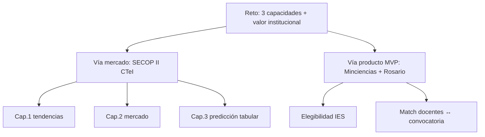
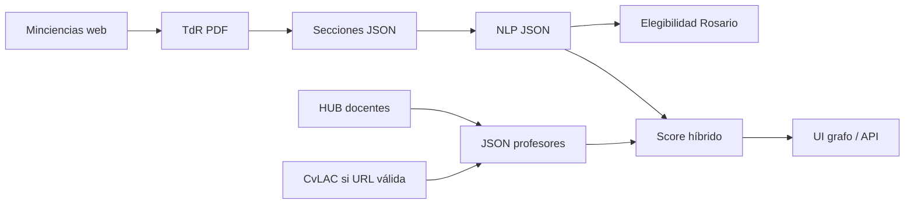

# ConvocaUR — documentación maestra

**Universidad del Rosario · Reto ServiSquad**  
Documento canónico de *qué es el proyecto, de dónde sale cada dato, por qué se filtró así, qué está listo para el MVP y qué limitaciones aceptamos a propósito.*

Última actualización de cifras: **2026-08-05** (dashboard Cap.1–3 + red Rosario, matching a escala, plan de manejo, deploy Vercel/Fly).

---

## 1. Qué pide el reto (las tres capacidades)

Desarrollar IA para **análisis y predicción de dinámicas de contratación pública**:

| # | Capacidad | Pregunta |
|---|-----------|----------|
| **1** | Tendencias históricas | Patrones temporales, estacionalidad, sector, monto, modalidad |
| **2** | Dinámicas de mercado | Relaciones entidad–proveedor, concentración, evolución de participación |
| **3** | Predicción | Tipo de contratación, rangos de presupuesto, probabilidad de adjudicación, sectores de inversión |

Eso exige datos de **mercado transaccional** → vía **SECOP II**.

En paralelo, Rosario necesita **actuar** sobre oportunidades CTeI: ¿podemos entrar a esta convocatoria y con qué equipo? Eso no lo responde SECOP solo → vía **Minciencias + docentes**.



Detalle narrativo ampliado: [`docs/del_reto_a_mvp.md`](docs/del_reto_a_mvp.md).

---

## 2. Por qué dos vías (y no solo una)

| Vía | Responde | No responde bien |
|-----|----------|------------------|
| **SECOP** | Cómo se mueve el mercado (quién compra, a quién, cuánto, cuándo) | Elegibilidad de una convocatoria Minciencias ni el talento interno |
| **Minciencias + Rosario** | TdR legibles, requisitos, ¿Rosario puede?, ¿qué docentes encajan? | Series de adjudicación ni redes de proveedores |

**Decisión de MVP de producto:** Minciencias, porque:

1. La web oficial publica **TdR y anexos descargables** (documentos completos).
2. El dominio es **CTeI explícito**, alineado a Rosario.
3. Permite un ciclo corto: scrape → PDF → secciones → JSON → elegibilidad → match.
4. SECOP sigue siendo la evidencia de las **3 capacidades de mercado**, empaquetada en `analisis/secop/`.

---

## 3. Estado actual (números reales)

### 3.1 Minciencias / ConvocaUR

| Activo | Cantidad | Dónde |
|--------|----------|--------|
| Listado scrapeado | **130** | `data/raw/minciencias/convocatorias_listado_raw.csv` |
| TdR PDF normalizados | **98** | `data/raw/minciencias/tdr/` |
| JSON secciones | **97** | `data/processed/minciencias/secciones/` |
| JSON NLP | **95** | `data/processed/minciencias/nlp/` |
| JSON elegibilidad Rosario | **95** | `data/processed/minciencias/elegibilidad/` |
| Docentes CSV / JSON | **613 / 612** | `data/raw/urosario/` |
| Con bloque CvLAC usable | **353** | dentro de `json_profesores/` |
| Sin CvLAC usable | **259** | `sin_cvlac.csv` |

Gaps conocidos NLP/elegibilidad (hay secciones, falta NLP): **951, 963**.

Elegibilidad (resumen n=95): ~**61** pueden postularse en algún modo; ~**34** no elegibles; modos frecuentes: `solo_en_alianza`, `no_elegible`, `sola`, etc.

### 3.2 Matching (paquete del proyecto)

| Activo | Estado |
|--------|--------|
| Fórmula | \(0.85\cos_{emb}+0.15\cos_{tfidf}+\mathrm{premio}_{perfil}\) → \([0,1]\) |
| Código | `src/convocaur/matching/` + `scripts/run_match.py` |
| Cache embeddings | ~615 vectores en `data/processed/matching/cache_embeddings/` |
| Rankings precalculados | ~**96** convocatorias con CSV en `data/processed/matching/` |
| Plan de manejo | `GET /api/plan/manejo` (elegibles + match + señal Cap.3) |
| UI | Node (Vite+React) `frontend/` + API FastAPI `backend/` |

### 3.3 SECOP (análisis de mercado)

| Activo | Estado |
|--------|--------|
| Universo CTeI | Proxy UNSPSC **80 / 81 / 86**, desde ~2022 |
| Cap. 1–2 | Notebooks EDA + **scripts build** → JSON dashboard |
| Cap. 2 extra | Red entidad↔proveedor, ego Rosario, peers IES (`build_capacidad2_red.py`) |
| Cap. 3 | Modelos `.joblib` + forecast TS (`build_capacidad3_forecast_ts.py`) |
| Mejor adjudicación (competitivo al publicar) | LightGBM **AUC ≈ 0.81** (servir con **sklearn 1.6.1**) |
| Presupuesto bins | HGB ~**61%** vs trivial ~28% |
| Segmento tabular | HGB ~**68%** vs trivial ~62% (débil → embeddings futuros) |

---

## 4. De dónde llega cada fuente (y por qué esa)

### 4.1 SECOP II — mercado

- **Origen:** portal [datos.gov.co](https://www.datos.gov.co), dataset SECOP II procesos (API SODA tipo `p6dx-8zbt`).
- **Por qué no “todo SECOP”:** el reto apunta a dinámicas afines a CTeI/conocimiento; el dump completo es ruido para Rosario.
- **Filtro CTeI (proxy):** segmento UNSPSC derivado de `codigo_principal_de_categoria` (quitar `V1.`):
  - **81** Ingeniería / investigación / tecnología (~44%)
  - **80** Gestión / profesionales (~35%)
  - **86** Educación / capacitación (~21%)
- **Por qué proxy y no “solo Minciencias”:** en SECOP no hay un flag limpio SNCTI; UNSPSC 80/81/86 es el mejor corte operativo reproducible.
- **Limpieza:** deduplicación tras recargas mid-download → `*_limpio.csv`.
- **IPC:** anexo DANE `anex-IPC-jun2026.xlsx` → serie interpolada → montos en COP constantes (`*_deflactado*`).
- **Outliers:** regla absoluto (>10¹³ COP) o relativo (>100× precio_base); CSV preferido `*_deflactado_sin_implausibles.csv` para no destruir HHI/series.
- **Carpeta:** `analisis/secop/` (CSV grandes gitignored).

### 4.2 Minciencias — convocatorias / TdR

- **Origen:** [minciencias.gov.co/convocatorias](https://minciencias.gov.co/convocatorias/todas) (HTML scrape; no hay API pública equivalente a SECOP).
- **Qué se guarda:** listado, actividades, documentos (URLs), archivos, TdR normalizado `convocatoria_{N}_tdr.pdf`.
- **Por qué solo TdR para NLP:** el TdR concentra objetivo, elegibles, requisitos, criterios y financiación; anexos se usan cuando hace falta, no como texto principal del match.
- **Extracción de texto (evolución del equipo):**
  1. pdfplumber (preferido) → pypdf
  2. Si PDF escaneado sin capa de texto → **OCR vía LLM de visión** (OpenRouter)
  3. Corte por tabla de contenido → JSON secciones
  4. Mapeo P0 → LLM → JSON tipado (con resiliencia si falta una sección)
- **Elegibilidad:** reglas + LLM sobre el JSON NLP → veredicto Rosario (IES, alianza, condiciones).

Código: `src/convocaur/minciencias/`, `src/convocaur/nlp/`. Scripts: `scripts/`.

### 4.3 Docentes Rosario — HUB + CvLAC

- **Origen HUB:** research-hub Universidad del Rosario → CSV + JSON por docente.
- **Origen CvLAC:** Scienti Minciencias, **solo si** el HUB trae URL usable (`cod_rh`, http válido).
- **Limitación MVP confirmada — sin CvLAC:**

  > Los **259** docentes en `sin_cvlac.csv` **no tienen un enlace CvLAC usable** en el HUB (faltante, placeholder tipo “No”, URL vieja sin `cod_rh`, o enlace que no existe / no resuelve a un CvLAC válido).  
  > No son fallos de scrape masivo (`cvlac_failures` está vacío).  
  > **Para el MVP trabajamos con los ~353 que sí tienen bloque CvLAC** (categoría, líneas, proyectos). Los 259 entran como perfiles HUB más delgados o se excluyen del ranking semántico fuerte.

- **Por qué importa:** el boost de matching y la calidad del texto embebido dependen mucho de CvLAC; inventar CvLAC rompería honestidad del MVP.

---

## 5. Cómo se hace cada capacidad (SECOP)

### Capacidad 1 — Tendencias

- Series de procesos y valor **real** (IPC), con/sin “fondos administrados” (~28% del valor en 109 megacontratos).
- STL + Kruskal-Wallis: el mes **sí afecta** el volumen; Spearman entre años (ρ 0.32–0.57) → **no** hay patrón mensual idéntico año a año con solo 2023–2025.
- Mix sectorial estable 81/80/86.
- **Filtros por qué:** sin outliers la serie de valor miente; sin separar fondos, el “tamaño del mercado” lo dominan pocos contratos atípicos.

### Capacidad 2 — Mercado

- HHI/Pareto **después** de quitar implausibles (si no, HHI ~9995 por un outlier tipo EAG).
- Mercado agregado **poco concentrado**; nichos y fondos sí concentran.
- Alta rotación de participación entre años (`rotacion_anual` + `top1_nombre` vía `patch_rotacion_top1.py`).
- **Features post-notebook (scripts):**
  - `build_capacidad2_mercado.py` → HHI, Pareto, top proveedores, rotación
  - `build_capacidad2_red.py` → grafo navegable + ego Rosario + competidores + peers IES
  - `patch_es_ies.py` → reclasifica `es_ies` por razón social (sin rearmar el grafo)
- Siguiente mejora natural: **taxonomía semántica por embeddings** del objeto contractual.

### Capacidad 3 — Predicción

- **Solo modalidades competitivas** (~15% del universo): en régimen especial/directa `adjudicado` es estructuralmente 0%.
- Split **temporal** (corte 2025-07-01), features solo al publicar (sin fuga).
- Modelos guardados (`salidas_capacidad3/modelos/`):
  - `adjudicacion_competitivo.joblib` ← **usar este** (AUC ~0.81)
  - `presupuesto_bins.joblib`
  - `segmento_unspsc.joblib` (débil)
- **Por qué no “solo resueltos” en producción:** accuracy engañosa (trivial ~87%), AUC ~0.61.
- Servir desde **backend Python** (joblib); pin **`scikit-learn==1.6.1`** (pickle de entrenamiento).
- **Feature post-notebook:** `build_capacidad3_forecast_ts.py` (ETS/SARIMA/outlook de mercado) → UI Cap.3.

Notebook de entrenamiento: `analisis/secop/Capacidad3_entrenamiento_modelos.ipynb`.  
Puente notebooks → dashboard: ver §5.1 y [`scripts/README.md`](scripts/README.md).

### 5.1 De notebook a JSON (scripts exógenos)

Los `.ipynb` de `analisis/secop/` exploran y entrenan. Las **features que consume la UI** se regeneran con scripts (añadidos después del cierre analítico):

```text
Notebooks (EDA / Cap.1 cierre / Cap.3 train)
        │
        ▼
scripts/build_capacidad{1,2,3}_*.py   +   patch_es_ies / patch_rotacion_top1
        │
        ▼
data/processed/secop/*.json  →  API  →  frontend (SECOP / Plan)
```

Orden completo de rebuild: tabla en [`scripts/README.md`](scripts/README.md).

---

## 6. Cómo se hace el MVP producto (Minciencias ↔ Rosario)



### Matching — por qué esa fórmula

\[
\mathrm{sim}_i = 0.85\cdot\cos^{\mathrm{emb}}_i + 0.15\cdot\cos^{\mathrm{tfidf}}_i
\]
\[
\mathrm{score}_i = \mathrm{clip}\big(\mathrm{sim}_i + \mathrm{premio}_{perfil}(i),\,0,\,1\big)
\]

**Premios de perfil** (absolutos, no relativos al pool):

| Premio | Valor |
|--------|------:|
| CvLAC presente | +0.12 |
| Categoría Emérito / Senior / Asociado / Junior | +0.18 / +0.16 / +0.13 / +0.09 |
| Áreas de investigación (≥5 / ≥2 / ≥1) | +0.08 / +0.05 / +0.03 |

`score_raw` guarda solo la similitud textual; `boost` es el premio de perfil; `score_final = clip(sim + boost, 0, 1)`.

| Pieza | Por qué |
|-------|---------|
| Embeddings | Similitud semántica TdR ↔ perfil |
| TF-IDF 0.15 | Ancla términos literales |
| Premios de perfil | Reconocen CvLAC, categoría Minciencias y densidad de áreas |
| Cache / CSV | Igual que antes |

**Interpretación:** \(1\) = techo de la escala; \(0\) = sin relación ni premios. La similitud pura sigue en `score_raw`.

### Alcance MVP (consciente)

| Incluido | Queda fuera / después |
|----------|----------------------|
| Elegibilidad + rankings sobre el corpus NLP | Sync Minciencias 24/7 en producción institucional |
| Match con docentes **con CvLAC** (premios de perfil) | Forzar CvLAC en los 259 sin URL |
| Plan de manejo (match + señal Cap.3) | Sustituir evaluación humana / GrupLAC oficial |
| SECOP Cap.1–3 en UI + forecast TS + red Rosario | Embeddings de objeto contractual a escala |

---

## 7. Estructura del repo

```text
convocaur/
├── README.md                 ← este documento maestro
├── requirements.txt / requirements-api.txt
├── Dockerfile / fly.toml     ← deploy API (Fly)
├── docs/                     ← profundización + deploy.md
├── scripts/                  ← CLI: NLP, match, builds Cap.1–3, parches
├── frontend/                 ← UI Vite+React (Vercel)
├── backend/                  ← API FastAPI (SECOP + matching + plan)
├── analisis/secop/           ← notebooks Cap.1–3 + modelos .joblib
├── src/convocaur/
│   ├── paths.py
│   ├── matching/
│   ├── minciencias/
│   ├── urosario/
│   └── nlp/
└── data/
    ├── raw/                  ← Minciencias (PDFs gitignored) + Rosario JSON
    └── processed/            ← nlp, elegibilidad, matching, secop JSON
```

Rutas Python: `src/convocaur/paths.py`. Inventario de scripts: [`scripts/README.md`](scripts/README.md).

---

## 8. Documentación satélite

| Doc | Contenido |
|-----|-----------|
| [`docs/del_reto_a_mvp.md`](docs/del_reto_a_mvp.md) | Puente SECOP ↔ Minciencias |
| [`docs/arquitectura.md`](docs/arquitectura.md) | Capas y límites del sistema |
| [`docs/pipeline_minciencias.md`](docs/pipeline_minciencias.md) | Scrape → TdR → secciones |
| [`docs/nlp_y_elegibilidad.md`](docs/nlp_y_elegibilidad.md) | OpenRouter, schemas, veredicto |
| [`docs/capacidad_urosario.md`](docs/capacidad_urosario.md) | Docentes / CvLAC |
| [`docs/datos.md`](docs/datos.md) | Inventario de archivos |
| [`docs/catalogo_datos.md`](docs/catalogo_datos.md) | Rutas para notebooks / loaders |
| [`docs/roadmap_matching.md`](docs/roadmap_matching.md) | Evolución match / RAG |
| [`docs/matching_decisiones.md`](docs/matching_decisiones.md) | Decisiones del score |
| [`docs/hallazgos_exploracion.md`](docs/hallazgos_exploracion.md) | Hallazgos de exploración NLP/datos |
| [`docs/deploy.md`](docs/deploy.md) | Vercel (front) + Fly (API) |
| [`scripts/README.md`](scripts/README.md) | CLI + builds Cap.1–3 + parches exógenos |
| [`analisis/secop/README.md`](analisis/secop/README.md) | SECOP notebooks + puente a scripts |

---

## 9. Arranque rápido

```bash
cd convocaur
python -m venv .venv
.venv\Scripts\activate          # Windows
pip install -r requirements.txt
copy .env.example .env          # OPENROUTER_API_KEY
set PYTHONPATH=src
```

```bash
# NLP / elegibilidad (ejemplos)
python scripts/run_nlp_piloto.py --convocatorias 48,45,976
python scripts/run_elegibilidad.py

# Matching
python scripts/run_match.py --solo-faltantes

# Regenerar features SECOP del dashboard (post-notebooks)
py -3.12 scripts/build_capacidad1_mensual.py
py -3.12 scripts/build_capacidad2_mercado.py
py -3.12 scripts/build_capacidad2_red.py
py -3.12 scripts/patch_es_ies.py
py -3.12 scripts/patch_rotacion_top1.py
py -3.12 scripts/build_capacidad3_prediccion.py
py -3.12 scripts/build_capacidad3_forecast_ts.py

# Dashboard (API + UI) — Python 3.12 + scikit-learn==1.6.1 para Cap.3
set PYTHONPATH=src;backend
py -3.12 -m uvicorn app.main:app --reload --host 127.0.0.1 --port 8000
# otra terminal:
cd frontend && npm install && npm run dev   # http://127.0.0.1:5173
```

Cargar modelo Cap.3 (Python backend):

```python
import joblib
from pathlib import Path
p = Path("analisis/secop/salidas_capacidad3/modelos/adjudicacion_competitivo.joblib")
bundle = joblib.load(p)
modelo = bundle[bundle["modelo_recomendado"]]
```
---

## 10. Principios que no negociamos en el MVP

1. **Raw vs processed:** lo crudo se conserva; lo tipado se audita.
2. **Sin fuga temporal** en predicción SECOP.
3. **No inventar CvLAC** donde el link no existe.
4. **Elegibilidad ≠ match:** primero “¿podemos?”, luego “¿con quién?”.
5. **SECOP y Minciencias se documentan juntos** pero no se mezclan en un solo modelo mágico.
6. **Números honestos en el dashboard:** AUC, limitaciones de estacionalidad, fondos administrados, universo competitivo.
7. **Notebook ≠ producto:** features de UI se regeneran con `scripts/build_*` / `patch_*`.

---

## 11. Próximos pasos

1. Validación humana del plan de manejo en convocatorias abiertas.
2. Embeddings de objeto contractual (mejora Cap.2/3), sin bloquear el demo.
3. Completar CvLAC en el backlog HUB (259 sin URL usable).
4. Operación: sync Minciencias programado + monitoreo de modelos en Fly.

---

*Este README es la fuente de verdad del “porqué”. Si un doc satélite contradice cifras de la §3, prevalece este archivo hasta actualizar el satélite.*
