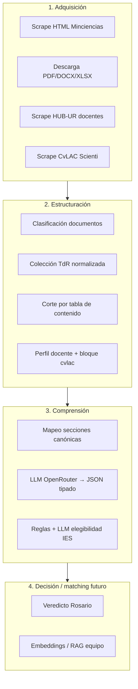
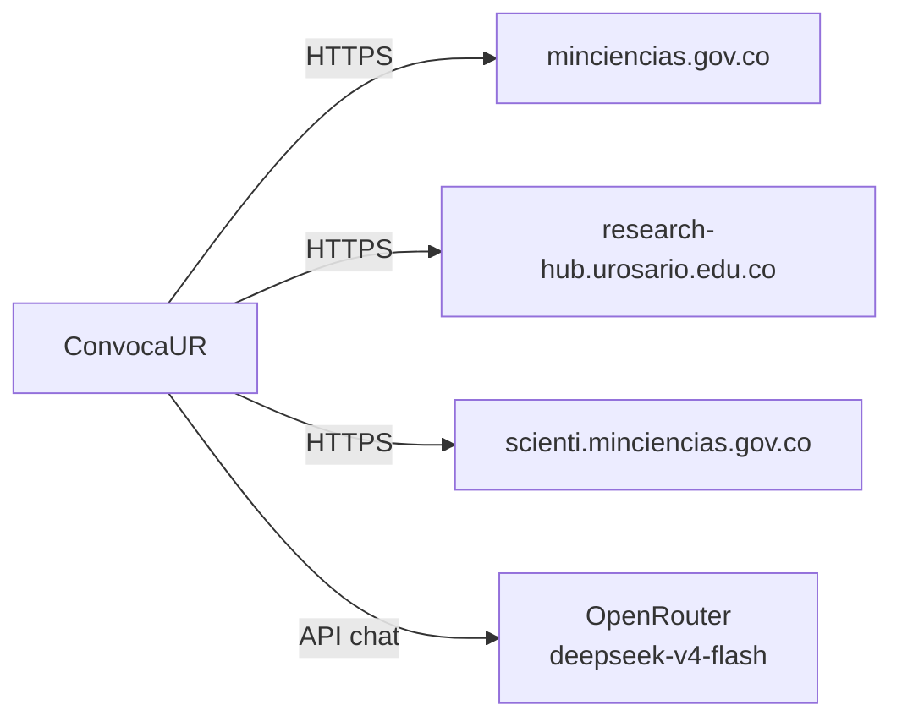
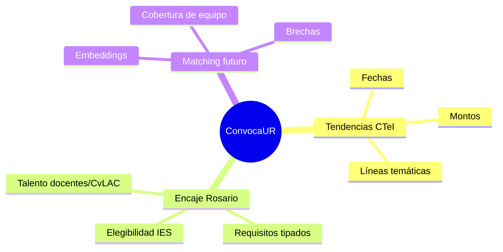

# Arquitectura ConvocaUR

## Visión

ConvocaUR transforma **documentos públicos de Minciencias** y **perfiles Rosario** en datos tipados para:

1. evaluar **elegibilidad institucional**;
2. preparar **matching de talento** (embeddings/RAG);
3. alimentar tablas tipo `maestro_convocatorias` y `requisitos_convocatoria`.

No es un scraper genérico: cada etapa produce un artefacto auditable en `data/`.

---

## Capas



---

## Qué SÍ hace / qué NO hace

| Sí | No |
|----|----|
| Extraer requisitos, actores, montos, criterios de TdR | Predecir adjudicaciones SECOP |
| Decir si Rosario entra como IES y en qué modo | Inventar grupos A1 sin fuente |
| Inventariar docentes + CvLAC | Sustituir capacidad financiera interna |
| Dejar JSON/CSV reproducibles | Entrenar el modelo final de mercado |

---

## Paquete Python

```text
src/convocaur/
├── paths.py           # única fuente de rutas data/
├── minciencias/       # scrape, descarga, TdR, secciones
├── urosario/          # docentes HUB + CvLAC
└── nlp/               # LLM, schemas, elegibilidad
```

Los scripts de `scripts/` solo orquestan; la lógica vive en el paquete.

---

## Dependencias externas



Secretos solo en `.env` (nunca en git).

---

## Flujo de valor hacia el reto


