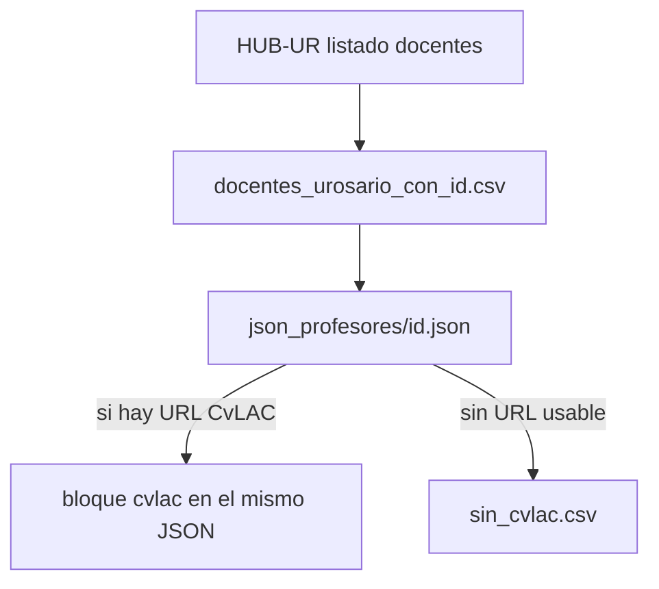
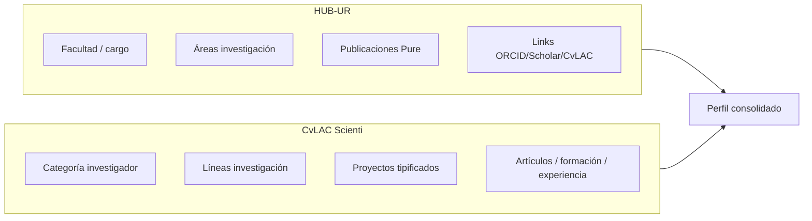
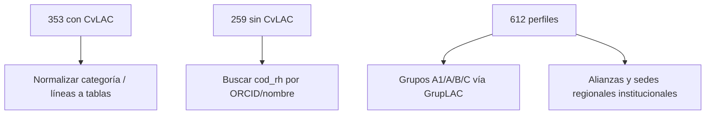

# Capacidad Universidad del Rosario

## Objetivo

Construir el lado **oferta** del sistema: quién investiga, en qué, con qué evidencia (HUB-UR + CvLAC).

---

## Flujo

---

## Artefactos

| Archivo / carpeta | Qué es |
|-------------------|--------|
| `data/raw/urosario/docentes_urosario_con_id.csv` | 613 docentes: `id`, facultad, cargo, link, `json_file` |
| `data/raw/urosario/json_profesores/*.json` | Perfil HUB (áreas, pubs, proyectos, enlaces) |
| `…/json_profesores/*.json` → clave `cvlac` | Enriquecimiento Scienti (353 docentes) |
| `data/raw/urosario/sin_cvlac.csv` | 259 ids **sin link CvLAC** en el hub (no es fallo de red) |

---

## Qué trae el HUB vs CvLAC

### Categorías Minciencias vistas en el piloto CvLAC

- Investigador Junior  
- Investigador Asociado  
- Investigador Senior  
- Investigador Emérito  
- (+ muchos sin categoría declarada en datos generales)

---

## Módulos

| Módulo | Rol |
|--------|-----|
| `urosario/scrape_docentes.py` | Recorre CSV, baja perfiles HUB → JSON |
| `urosario/cvlac_parser.py` | Parsea HTML CvLAC → dict por secciones |
| `urosario/scrape_cvlac.py` | Inserta `cvlac` en JSON existentes |
| `urosario/hub.py` | Utilidades KPI / perfiles (legado notebook) |

---

## Huecos conocidos

Sin grupos categorizados y sin presencia territorial, el matching semántico puede sugerir talento bueno que **aún no habilita** algunas convocatorias SGR.
