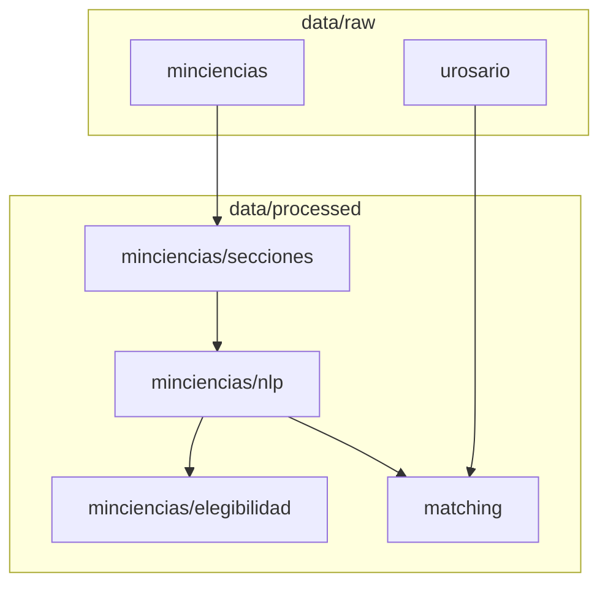

# Catálogo de datos ConvocaUR

> Cifras canónicas y el “porqué” de filtros/fuentes: **[`README.md`](../README.md)** (doc maestro).

---

## Mapa mental



---

## Minciencias — raw

> **`data/raw/minciencias/` está en `.gitignore`** (pesa ~2GB con los PDF/DOCX descargados).
> Respaldo completo: [Google Drive](https://drive.google.com/drive/u/0/folders/1btG97eUuX6vatFPcj-l_LfzW-kpLgyT4).

| Si quieres… | Archivo | Notas |
|-------------|---------|-------|
| Listado de convocatorias | `data/raw/minciencias/convocatorias_listado_raw.csv` | número, título, URL, recursos, fecha |
| Cronograma / hitos | `data/raw/minciencias/convocatorias_actividades_raw.csv` | apertura, cierre, resultados… |
| Metadatos de documentos | `data/raw/minciencias/convocatorias_documentos_raw.csv` | tipo, subtipo, url_pdf / url_editable |
| PDF/DOCX descargados | `data/raw/minciencias/archivos/convocatoria_{N}/` | un folder por convocatoria |
| Solo TdR normalizados | `data/raw/minciencias/tdr/convocatoria_{N}_tdr.pdf` | |

**Loader:** `from convocaur.cargar_datos import cargar_todo`

---

## Minciencias — processed

| Si quieres… | Archivo / carpeta |
|-------------|-------------------|
| Listado limpio | `data/processed/minciencias/minciencias_convocatorias_processed.csv` |
| Texto TdR por sección | `data/processed/minciencias/secciones/convocatoria_{N}_secciones.json` |
| Extracción NLP tipada | `data/processed/minciencias/nlp/convocatoria_{N}_nlp.json` |
| Elegibilidad Rosario | `data/processed/minciencias/elegibilidad/convocatoria_{N}_elegibilidad.json` |

---

## Universidad del Rosario — raw

| Si quieres… | Archivo / carpeta |
|-------------|-------------------|
| Índice de docentes + id | `data/raw/urosario/docentes_urosario_con_id.csv` |
| Perfil completo HUB (+ CvLAC si hay) | `data/raw/urosario/json_profesores/{id}.json` |
| Quién no tiene CvLAC expandible | `data/raw/urosario/sin_cvlac.csv` |

---

## Matching — salidas

| Si quieres… | Archivo / carpeta |
|-------------|-------------------|
| Rankings piloto | `data/processed/matching/ranking_convocatoria_{N}.csv` |
| Resumen | `data/processed/matching/resumen_match.json` |
| Cache embeddings | `data/processed/matching/cache_embeddings/` (gitignored) |
| Exploración (shortlists / cobertura) | `data/processed/exploracion/` |

```python
from convocaur.cargar_datos import guardar_salida
guardar_salida("ranking_demo.csv", df)  # → data/processed/matching/
```

---

## SECOP CTeI — vía mercado del reto

> Vive en **`analisis/secop/`**. Los `secop_ctei_*.csv` (~2 GB) están en `.gitignore`.

| Si quieres… | Archivo |
|-------------|---------|
| Procesos limpios | `analisis/secop/secop_ctei_procesos_limpio.csv` |
| Líneas limpias | `analisis/secop/secop_ctei_lineas_limpio.csv` |
| Procesos deflactados (IPC) | `analisis/secop/secop_ctei_procesos_deflactado.csv` |
| Serie IPC | `analisis/secop/ipc_dane_mensual_interpolado_TOTAL.csv` |
| Anexo DANE | `analisis/secop/anex-IPC-jun2026.xlsx` |
| EDA / Cap.1–3 | `analisis/secop/*.ipynb` |
| Modelos Cap.3 | `analisis/secop/salidas_capacidad3/modelos/` |

Narrativa: [`del_reto_a_mvp.md`](del_reto_a_mvp.md).  
Constantes: `convocaur.paths.SECOP`, `SECOP_PROCESOS_DEFLACTADO`, etc.
