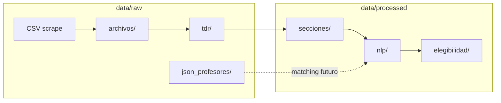

# Datos — dónde entran y dónde salen

## Árbol canónico

```text
data/
├── raw/
│   ├── minciencias/
│   │   ├── convocatorias_listado_raw.csv
│   │   ├── convocatorias_actividades_raw.csv
│   │   ├── convocatorias_documentos_raw.csv
│   │   ├── anexos_contenido_raw.json
│   │   ├── archivos/
│   │   │   └── convocatoria_{N}/          ← PDF/DOCX/XLSX originales
│   │   └── tdr/
│   │       └── convocatoria_{N}_tdr.pdf   ← TdR normalizados
│   └── urosario/
│       ├── docentes_urosario_con_id.csv
│       ├── sin_cvlac.csv
│       ├── cvlac_failures.csv
│       └── json_profesores/
│           └── {id}.json                  ← HUB (+ cvlac si aplica)
└── processed/
    └── minciencias/
        ├── minciencias_*_processed.csv
        ├── secciones/
        │   ├── convocatoria_{N}_secciones.json
        │   ├── estructura_comparacion.csv
        │   └── estructura_resumen.json
        ├── nlp/
        │   ├── convocatoria_{N}_nlp.json
        │   ├── piloto_resumen.json
        │   └── CRUDO_INPUT_OUTPUT_PILOTO.md
        └── elegibilidad/
            ├── convocatoria_{N}_elegibilidad.json
            └── resumen_elegibilidad.json
```

Todas las rutas se resuelven desde `convocaur.paths`.

---

## Diagrama entrada → salida



---

## Contrato mínimo de artefactos clave

### `convocatoria_N_secciones.json`

- `convocatoria`, `n_paginas`
- `secciones[]`: `numero`, `titulo`, `titulo_norm`, `texto`, `n_caracteres`
- `fingerprint`, comparación vs plantilla SGR

### `convocatoria_N_nlp.json`

- Campos tipados P0 + `meta.secciones`
- `elegibilidad_urosario` (si se corrió con elegibilidad)

### `json_profesores/{id}.json`

- Perfil HUB: `areas_investigacion`, `publicaciones`, `proyectos`, `enlaces_externos`
- Opcional: `cvlac` con `datos_generales.Categoría`, líneas, artículos, proyectos Scienti

---

## Principio raw vs processed

| raw | processed |
|-----|-----------|
| Conserva origen | Normaliza / tipa |
| Re-scrapeable | Comparable entre convocatorias |
| Puede ser ruidoso | Listo para modelos / UI |

No editar a mano los `raw/` si se puede re-generar con scripts.
