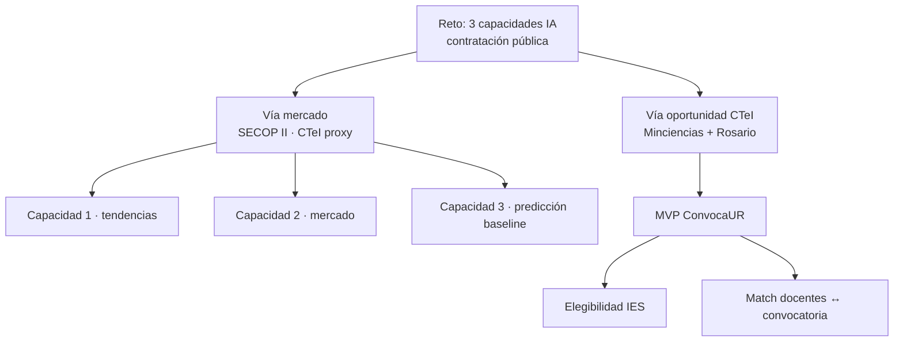
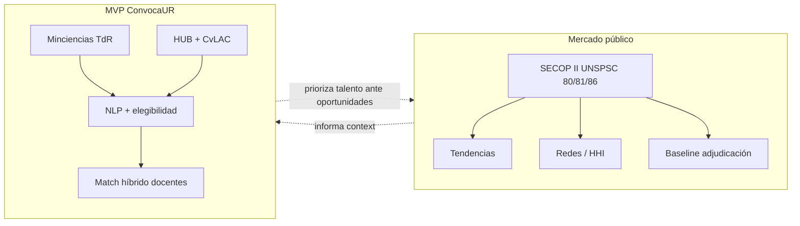

# Del reto a las dos vías: SECOP (mercado) y Minciencias (MVP de match)

Documento de narrativa del proyecto **ServiSquad / ConvocaUR** (Universidad del Rosario).

Une:

1. el enunciado del reto (tres capacidades de IA sobre contratación pública);
2. el trabajo de análisis SECOP en `analisis/secop/`;
3. la decisión de MVP con **Minciencias + docentes Rosario**;
4. la herramienta de **matching** convocatoria ↔ talento.

---

## 1. Qué pide el reto (las tres capacidades)

Desarrollar un modelo de IA para **análisis y predicción de dinámicas de contratación pública**, con:

| # | Capacidad | Pregunta de negocio |
|---|-----------|---------------------|
| **1** | Tendencias históricas | ¿Hay estacionalidad, patrones por sector, monto y modalidad en planes/procesos? |
| **2** | Dinámicas de mercado | ¿Cómo se relacionan entidades y proveedores? ¿Concentración? ¿Quién gana participación? |
| **3** | Predicción | ¿Qué tipo de contratación, rangos de presupuesto, probabilidad de adjudicación y sectores de inversión se esperan en un periodo? |

Eso exige, de fondo, **datos transaccionales de mercado** (quién compra, a quién, cuánto, cuándo, con qué modalidad) — el terreno natural de **SECOP**.

En paralelo, la Universidad del Rosario necesita una pieza accionable para CTeI: **¿podemos entrar a esta convocatoria y con qué equipo?** Eso no se responde solo con SECOP; requiere **TdR legibles + capacidad investigativa**.

Por eso el proyecto se bifurcó en **dos vías complementarias**, no excluyentes.



---

## 2. Vía SECOP — de la propuesta del reto al análisis

**Carpeta canónica (dentro de ConvocaUR):**

```text
convocaur/analisis/secop/
```

(Copia integrada del workspace de exploración SECOP.)

### 2.1 Por qué SECOP (y ese CSV)

El reto habla de **contratación pública**. En Colombia la fuente canónica abierta es **SECOP II**, publicada en [datos.gov.co](https://www.datos.gov.co) (dataset de procesos de contratación; API SODA tipo `p6dx-8zbt` / `https://www.datos.gov.co/resource/p6dx-8zbt.json`). El monorepo ya tenía utilidades de descarga alineadas a ese recurso (`descargar_datos_reales.py`).

**Cómo se acotó a CTeI (no es “solo Minciencias”):**

No existe un filtro oficial limpio “solo ciencia y tecnología” en SECOP. El proxy usado fue el **segmento UNSPSC** derivado de `codigo_principal_de_categoria` (quitando el prefijo `V1.`):

| Segmento | Lectura | Peso aprox. en el universo |
|----------|---------|----------------------------|
| **81** | Ingeniería, investigación y tecnología | ~44% |
| **80** | Servicios de gestión / profesionales | ~35% |
| **86** | Educación / capacitación | ~21% |

**Ventana temporal:** publicaciones desde **2022-01-01** hasta ~**2026-07-29**.

Ese filtro produce el universo de trabajo:

| Archivo | Rol | Escala |
|---------|-----|--------|
| `secop_ctei_lineas.csv` | Línea ≈ proceso × proveedor × lote | ~864k filas (antes de limpiar) |
| `secop_ctei_procesos.csv` | Agregado por proceso | ~493k procesos |
| `*_limpio.csv` | Deduplicado tras recarga mid-download | ~495k líneas / ~493k procesos |
| `secop_ctei_procesos_deflactado.csv` | Montos en COP constantes | misma escala de procesos |

> **Honestidad:** CTeI aquí = **proxy UNSPSC 80/81/86**, no el listado de contratos firmados por Minciencias ni el SNCTI completo. Sirve para tendencias de mercado afines a conocimiento/servicios intensivos en expertise; no sustituye TdR de convocatorias.

### 2.2 IPC — de dónde salen los valores

Para comparar montos en el tiempo (Capacidad 1) hace falta **deflactar**.

1. **Fuente oficial:** anexo de IPC DANE  
   `anex-IPC-jun2026.xlsx` (descargado de la plataforma DANE; actualización citada ~jul-2026, series hasta jun-2026, base dic-2018=100).
2. **Serie operativa:** como el anexo no trae el mensual “Total nacional” listo para todo el rango 2022–2026 en el formato que necesitaban, se construyó  
   `ipc_dane_mensual_interpolado_TOTAL.csv`  
   interpolando geométricamente entre anclas semestrales (dic/jun) → 55 filas mensuales ene-2022 → jul-2026.
3. **Uso:**  
   `factor_deflactor = IPC_jun2026 / IPC_mes`  
   → `precio_base_real`, `valor_adjudicado_total_real` en `secop_ctei_procesos_deflactado.csv`.

Jul-2026 se copia de jun-2026 cuando aún no hay ancla DANE.

### 2.3 Orden de trabajo (archivos → notebooks)

**Datos (30/07/2026), en orden de aparición:**

1. Extracción SECOP filtrada → `secop_ctei_procesos.csv` / `secop_ctei_lineas.csv`
2. Limpieza (deduplicación por recarga a mitad de descarga) → `*_limpio.csv`
3. Anexo IPC Excel → serie interpolada CSV → procesos deflactados

**Notebooks (31/07/2026)** — lectura recomendada en este orden narrativo (el de creación en disco puede diferir por copias/edición):

| Orden | Notebook | Aporte al reto |
|------:|----------|----------------|
| 1 | `EDA_SECOP_CTeI_limpio.ipynb` | Integridad + primeras Cap. 1/2/3; halla outlier EAG, 0% adjud. en no competitivas, riesgo de fuga |
| 2 | `Correcciones_outliers_y_modelado.ipynb` | Forense outliers; mercado real; IPC→deflactado; diseño Cap. 3 sin fuga |
| 3 | `Capacidad1_cierre_final.ipynb` | Cierre Capacidad 1 en COP constantes (STL, Kruskal-Wallis, fondos administrados) |
| 4 | `Modelo_baseline_adjudicacion.ipynb` | Baseline Capacidad 3 (trivial / regla por modalidad / logística) |

### 2.4 Cómo cada capacidad se materializó en SECOP

**Capacidad 1 — Tendencias**  
Series mensuales, estacionalidad (p.ej. efecto enero), dominancia por segmento UNSPSC y modalidad, montos en pesos constantes, exclusión/flag de outliers y de “fondos administrados” (megacontratos de un proveedor que distorsionan totales).

**Capacidad 2 — Mercado**  
HHI y Pareto **después** de corregir el outlier (~2×10¹⁷ COP) que artificialmente concentraba el mercado. Red entidad–proveedor: la mayoría vende a pocas entidades; hay nichos concentrados reales (a menudo fondos/operadores).

**Capacidad 3 — Predicción**  
Solo tiene sentido en **modalidades competitivas** (~15% del universo): en régimen especial y contratación directa el campo `adjudicado` es estructuralmente 0%. Baseline con split temporal, features sin fuga (precio base real, duración, modalidad, segmento, geografía, calendario). Resultado: accuracy trivial alta por desbalance; logística con poder predictivo débil (AUC ~0.59) — honestidad metodológica, no “modelo listo para producción”.

### 2.5 Limitaciones que el propio análisis deja claras

- Proxy UNSPSC ≠ definición institucional CTeI.
- ~82% de procesos no competitivos no sirven para aprender “probabilidad de adjudicación” global.
- Procesos abiertos vs resueltos (censura a la derecha).
- IPC interpolado ≠ serie mensual oficial completa.
- Outliers SECOP obligan a reglas de plausibilidad.
- El baseline no incluye aún historial entidad/proveedor ni embeddings del objeto contractual.

SECOP responde bien a **“cómo se mueve el mercado”**. No responde solo a **“qué convocatoria Minciencias encaja con Rosario y con quién”**.

---

## 3. Por qué el MVP operativo es Minciencias (no SECOP)

Para un MVP de **herramienta usable** hacía falta:

1. **Documentos públicos completos** (TdR, anexos, resoluciones) en un sitio oficial navegable.
2. Texto suficiente para **extraer requisitos, actores, montos, criterios**.
3. Cruce con **capacidad humana** de la universidad (HUB + CvLAC).

**Minciencias** cumple eso de forma directa:

- Listado y detalle en [minciencias.gov.co/convocatorias](https://minciencias.gov.co/convocatorias/todas).
- Cada convocatoria publica **TdR y anexos descargables** (PDF) — perfecto para scrape → PDF → secciones → NLP.
- El dominio es **CTeI explícito**, alineado al interés Rosario.
- Permite un ciclo corto: *¿podemos postularnos?* → *¿con qué docentes?*

**SECOP**, en cambio, es excelente para series y redes de adjudicación, pero:

- el “objeto del contrato” no reemplaza un TdR de convocatoria de investigación;
- no trae elegibilidad tipo “IES + alianza + grupo A1”;
- no inventaría el talento interno de Rosario.

Por eso:

> **SECOP = vía analítica de las 3 capacidades de mercado.**  
> **Minciencias + Rosario = vía MVP de producto (ConvocaUR + matching).**

Ambas alimentan el mismo relato del reto: entender el entorno público de CTeI **y** convertir esa comprensión en decisión institucional.



---

## 4. La herramienta de match (ConvocaUR)

Implementada bajo `convocaur/` (`src/convocaur/matching/`, `web/`, `scripts/run_match.py`).

### 4.1 Cadena Minciencias

1. Scrape listado + documentos.
2. Colección solo **TdR** normalizados.
3. Corte por secciones (TOC).
4. NLP tipado (OpenRouter) → JSON (objetivo, actores, requisitos, criterios, financiación…).
5. Elegibilidad Universidad del Rosario (reglas + LLM).

### 4.2 Cadena talento

- Docentes HUB-UR (~612 JSON).
- Enriquecimiento CvLAC cuando hay URL (~353).
- Texto canónico por docente (áreas, perfil, líneas, proyectos, categoría).

### 4.3 Matching

Score híbrido:

\[
score = 0.7\cdot\cos_{emb} + 0.3\cdot\cos_{tfidf} + boost
\]

- Embeddings (`text-embedding-3-small` vía OpenRouter) con **cache en disco** (no se recrean en cada consulta de la UI).
- TF-IDF ancla términos literales del TdR.
- Boost suave por CvLAC / categoría Minciencias.
- UI FastAPI + grafo convocatoria → top docentes → aportes al puntaje.

Detalle técnico: [`matching_decisiones.md`](matching_decisiones.md), UI en [`../web/`](../web/).

**Qué aporta al reto:** no predice adjudicaciones SECOP; **opera** la capa de talento para oportunidades CTeI detectables en Minciencias — el eslabón que el análisis de mercado no puede cerrar solo.

---

## 5. Mapa de carpetas (dónde vive cada cosa)

| Pieza | Ubicación |
|-------|-----------|
| Análisis SECOP Cap. 1–3 + CSV + IPC | `convocaur/analisis/secop/` |
| Pipeline Minciencias + NLP + elegibilidad | `convocaur/` (`src/`, `data/`, `scripts/`) |
| Matching + UI grafo | `convocaur/src/convocaur/matching/` + `convocaur/web/` |
| Docs de arquitectura ConvocaUR | `convocaur/docs/` |

---

## 6. Mensaje de una frase (para el entregable)

El reto exige entender **dinámicas de contratación** (SECOP, tres capacidades) y, para Rosario, **actuar sobre oportunidades CTeI**. SECOP, filtrado por UNSPSC 80/81/86 y deflactado con IPC DANE, sostiene tendencias, mercado y un baseline de predicción. Minciencias, por tener TdR públicos completos, sostiene el **MVP**: estructurar convocatorias, decidir elegibilidad y **hacer match** con la plantilla docente — la herramienta que convierte el análisis en recomendación usable.
