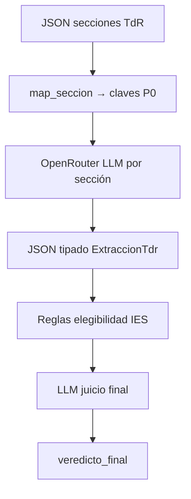
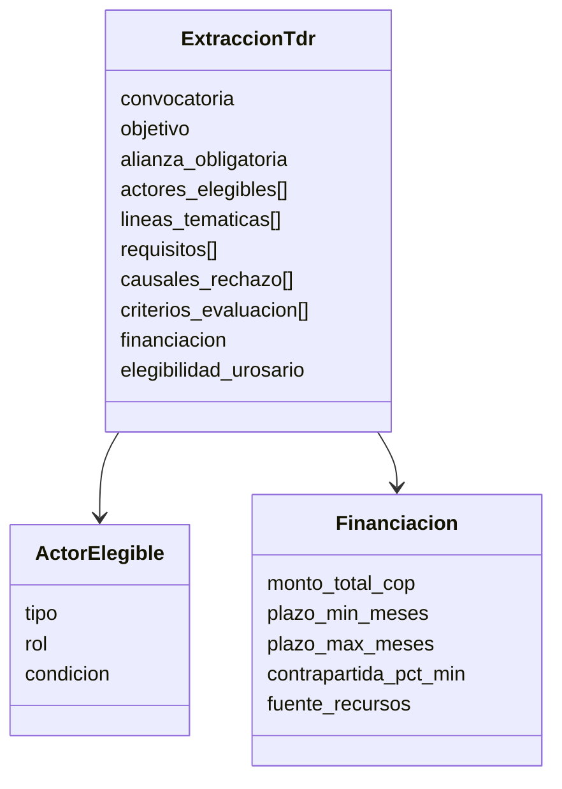
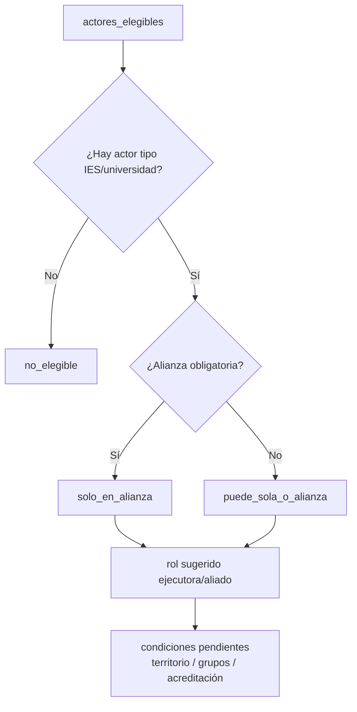

# NLP y elegibilidad Rosario

## Objetivo

Convertir secciones de TdR en **JSON tipado** y decidir si la **Universidad del Rosario (IES)** puede postularse.

---

## Flujo NLP



### Secciones P0

| Clave | Uso |
|-------|-----|
| `objetivo` | Resumen de la convocatoria |
| `dirigida_a` | Actores + alianza obligatoria |
| `lineas_tematicas` | Modalidades / ejes |
| `requisitos` | Habilitantes / documentales |
| `rechazo` | Causales |
| `financiacion` | Monto, plazos, contrapartida |
| `criterios` | Criterios y puntajes |

---

## Schema de salida (resumen)



---

## Elegibilidad Rosario



Perfil institucional fijo: `nlp/perfil_urosario.py` (IES privada, sede Bogotá, actor SNCTI).

### Piloto verificado

| Conv | ¿Puede? | Modo | Rol |
|------|---------|------|-----|
| 48 | Sí | solo en alianza | ejecutora |
| 45 | Sí | sola o alianza | ejecutora |
| 976 | Sí | solo en alianza | ejecutora |

---

## Configuración LLM

```env
OPENROUTER_API_KEY=sk-or-v1-...
OPENROUTER_MODEL=deepseek/deepseek-v4-flash
```

Cliente HTTP en `nlp/extract_llm.py` (sin SDK pesado).  
Input = **sección**, no PDF completo.

---

## Salidas

```text
data/processed/minciencias/nlp/convocatoria_{N}_nlp.json
data/processed/minciencias/elegibilidad/convocatoria_{N}_elegibilidad.json
```

Comandos:

```bash
set PYTHONPATH=src
python scripts/run_nlp_piloto.py --convocatorias 48,45,976
python scripts/run_elegibilidad.py --convocatorias 48,45,976
```
