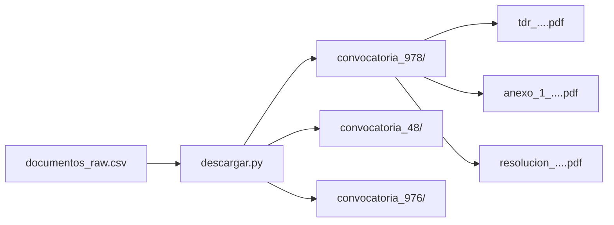
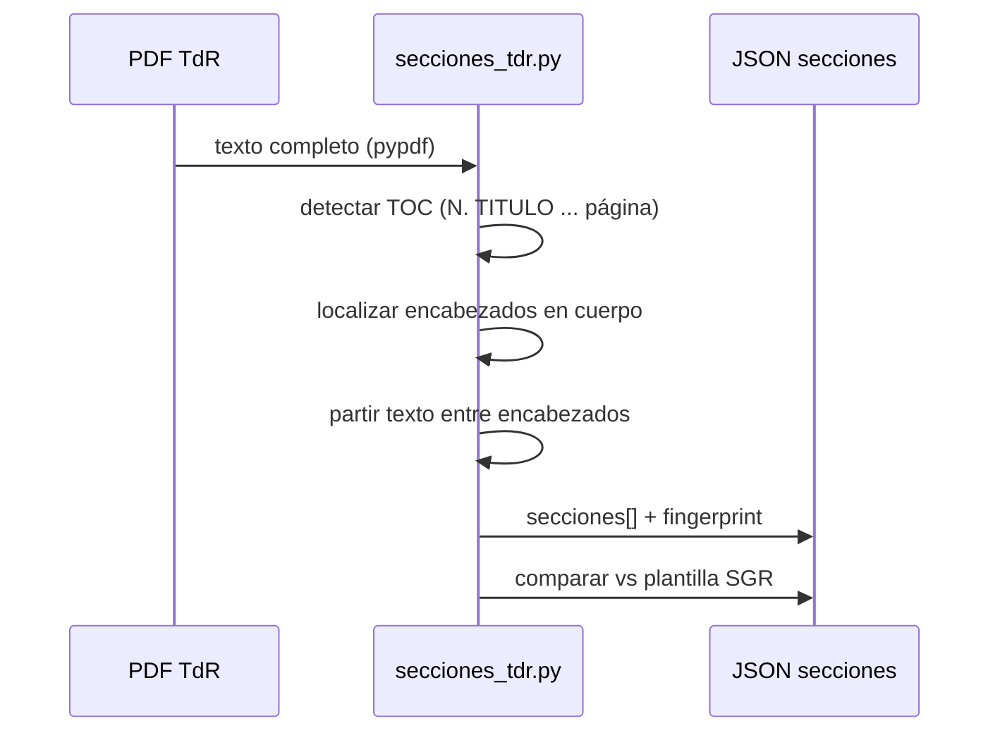

# Pipeline Minciencias

## Objetivo

Pasar de páginas web públicas a **archivos locales** y **texto seccionado** listo para NLP.

---

## Flujo

```mermaid
flowchart TD
  A[Listado /convocatorias/todas] --> B[Detalle por convocatoria]
  B --> C[CSV listado + actividades + documentos]
  C --> D[Descarga archivos por carpeta]
  D --> E[Detectar y coleccionar TdR]
  E --> F[Extraer texto PDF]
  F --> G[Partir por TOC / encabezados]
  G --> H[JSON secciones + comparación estructura]
```



---

## Etapas y módulos

| # | Etapa | Módulo | Salida |
|---|-------|--------|--------|
| 1 | Scrape | `minciencias/scrape.py` | `data/raw/minciencias/*_raw.csv` |
| 2 | Descarga | `minciencias/descargar.py` | `data/raw/minciencias/archivos/convocatoria_N/` |
| 3 | TdR | `minciencias/coleccionar_tdr.py` | `data/raw/minciencias/tdr/convocatoria_N_tdr.pdf` |
| 4 | Secciones | `minciencias/secciones_tdr.py` | `data/processed/minciencias/secciones/*.json` |

---

## Organización de archivos descargados



Nombres en origen son irregulares (`tdr_…`, `terminos_de_referencia_…`).  
La colección TdR **normaliza** a `convocatoria_{N}_tdr.pdf`.

---

## Detección de TdR

Un documento cuenta como TdR si:

- `tipo_documento == terminos_referencia`, **o**
- el nombre contiene “términos de referencia” / `TdR`, **o**
- la URL contiene `tdr_` / `terminos_de_referencia`.

Así se recuperan los que el scraper clasificó como `otro`.

---

## Corte por secciones



Hallazgo clave: **no todos los TdR comparten el mismo TOC**. Las SGR se parecen; becas/Publindex/IA divergen.

---

## Comandos

```bash
set PYTHONPATH=src

python -m convocaur.minciencias.scrape --paginas 5
python -m convocaur.minciencias.descargar --piloto
python -m convocaur.minciencias.coleccionar_tdr
python -m convocaur.minciencias.secciones_tdr
```

(o equivalentes en `scripts/`).
