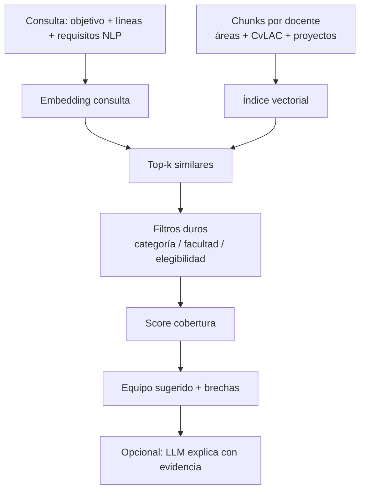
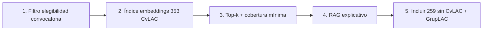

# Roadmap — matching con embeddings / RAG

## Meta

Dado una convocatoria (o un proyecto interno), responder:

1. **¿Qué profesores son más aptos?**
2. **¿Tenemos equipo suficiente?** (cobertura + brechas)

---

## Diseño propuesto



---

## Orden de implementación



1. **No rankear** convocatorias donde Rosario es `no_elegible`.
2. Indexar chunks de docentes con CvLAC (mejor señal).
3. Reglas de cobertura (p.ej. ≥1 Senior/Asociado, ≥2 líneas afines).
4. RAG solo para justificación.
5. Completar grupos A1/A/B y los sin CvLAC.

---

## Salida esperada (futuro)

```json
{
  "convocatoria": "976",
  "equipo_suficiente": "parcial",
  "candidatos": [
    {"id": "...", "score": 0.81, "rol_sugerido": "investigador_principal"}
  ],
  "brechas": ["falta evidencia sede regional", "sin grupo A1 explícito"]
}
```

Este documento es la hoja de ruta de evolución (índice vectorial, RAG, GrupLAC).

**Estado actual:** piloto operativo de matching híbrido
(embeddings + TF-IDF + boost) con UI grafo en
[`frontend/`](../frontend/) + [`backend/`](../backend/) — ver
[`matching_decisiones.md`](matching_decisiones.md).

Cómo encaja en el relato del reto (SECOP + Minciencias):
[`del_reto_a_mvp.md`](del_reto_a_mvp.md).

