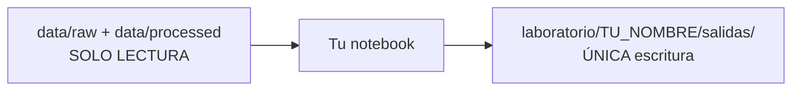

# Laboratorio ConvocaUR — trabajo en paralelo

Espacio para que **Josué, Andrés, Víctor, José y Rodolfo** analicen, prueben y experimenten **sin modificar** los datos canónicos de `data/`.

---

## Regla de oro



| Puedes | No puedes |
|--------|-----------|
| Leer todo `data/` | Sobrescribir CSV/JSON/PDF de `data/` |
| Escribir en `laboratorio/<tu_nombre>/salidas/` | Hacer push de basura grande a `main` |
| Commitear tu notebook si aporta | Subir `salidas/` (están en `.gitignore`) |

Si necesitas un dataset nuevo “oficial”, propón un PR que lo genere con un script en `src/` y lo deje en `data/processed/`.

---

## Carpetas por persona

```text
laboratorio/
├── README.md                 ← este archivo
├── catalogo_datos.md         ← rutas de cada CSV/JSON
├── _comun/cargar_datos.py    ← loader compartido
├── datasecopexplora/         ← vía SECOP (CSV + notebooks Cap. 1–3)
├── josue/
│   ├── exploracion.ipynb
│   └── salidas/              ← gitignored
├── andres/
├── victor/
├── jose/
└── rodolfo/
```

La carpeta **`datasecopexplora/`** concentra el análisis SECOP del reto (tendencias,
mercado, baseline de adjudicación). Los CSV grandes están en `.gitignore`; los
notebooks sí se versionan. Narrativa: [`docs/del_reto_a_mvp.md`](../docs/del_reto_a_mvp.md).

---

## Cómo empezar (2 minutos)

```bash
cd convocaur
pip install -r requirements.txt
pip install jupyter ipykernel   # si no lo tienes
```

1. Entra a `laboratorio/<tu_nombre>/exploracion.ipynb`
2. Ejecuta las celdas de setup (cargan datasets solos)
3. Trabaja abajo
4. Guarda resultados con `guardar_salida(...)` → caen en tu `salidas/`

---

## Qué sí conviene pushear a main

- Tu notebook con análisis **reproducible** (código limpio)
- Un `.md` corto de hallazgos en tu carpeta (opcional)
- Scripts reutilizables → mejor en `src/convocaur/` vía PR

## Qué no conviene pushear

- `salidas/` (csv/json grandes, dumps)
- `.env`
- Copias de `data/`

---

## Catálogo de datos

Ver **[catalogo_datos.md](catalogo_datos.md)** — ahí está cada CSV/JSON y para qué sirve.
