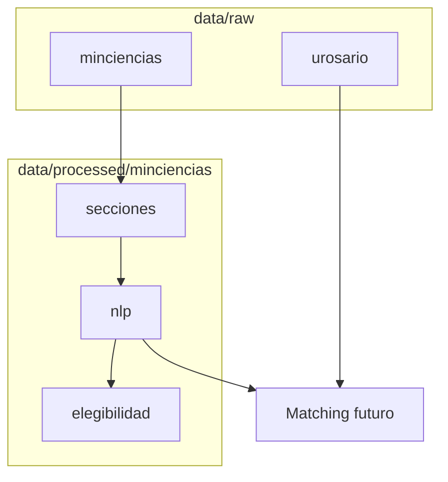

# Catálogo de datos ConvocaUR

Rutas relativas a la carpeta `convocaur/`.  
En notebooks usa el loader `_comun/cargar_datos.py` (no hardcodees paths si puedes evitarlo).

---

## Mapa mental



---

## Minciencias — raw

> **`data/raw/minciencias/` está en `.gitignore`** (pesa ~2GB con los PDF/DOCX descargados).
> Respaldo completo: [Google Drive](https://drive.google.com/drive/u/0/folders/1btG97eUuX6vatFPcj-l_LfzW-kpLgyT4).
> Si no lo tienes local, descárgalo de ahí o regenéralo con `src/convocaur/minciencias/descargar.py` y `coleccionar_tdr.py`.

| Si quieres… | Archivo | Notas |
|-------------|---------|-------|
| Listado de convocatorias | `data/raw/minciencias/convocatorias_listado_raw.csv` | número, título, URL, recursos, fecha |
| Cronograma / hitos | `data/raw/minciencias/convocatorias_actividades_raw.csv` | apertura, cierre, resultados… |
| Metadatos de documentos | `data/raw/minciencias/convocatorias_documentos_raw.csv` | tipo, subtipo, url_pdf / url_editable |
| PDF/DOCX descargados | `data/raw/minciencias/archivos/convocatoria_{N}/` | un folder por convocatoria |
| Solo TdR normalizados | `data/raw/minciencias/tdr/convocatoria_{N}_tdr.pdf` | 15 archivos en el piloto |
| Parseo crudo de anexos (legado) | `data/raw/minciencias/anexos_contenido_raw.json` | prototipo nivel 2 |

**Variable loader:** `datos["minciencias"]["listado"]`, `["actividades"]`, `["documentos"]`.

---

## Minciencias — processed

| Si quieres… | Archivo / carpeta |
|-------------|-------------------|
| Listado limpio | `data/processed/minciencias/minciencias_convocatorias_processed.csv` |
| Actividades limpio | `data/processed/minciencias/minciencias_actividades_processed.csv` |
| Documentos limpio | `data/processed/minciencias/minciencias_documentos_processed.csv` |
| Texto TdR por sección | `data/processed/minciencias/secciones/convocatoria_{N}_secciones.json` |
| Comparar estructuras TOC | `data/processed/minciencias/secciones/estructura_comparacion.csv` |
| Resumen estructuras | `data/processed/minciencias/secciones/estructura_resumen.json` |
| Extracción NLP tipada | `data/processed/minciencias/nlp/convocatoria_{N}_nlp.json` |
| Resumen NLP piloto | `data/processed/minciencias/nlp/piloto_resumen.json` |
| Crudo input/output NLP | `data/processed/minciencias/nlp/CRUDO_INPUT_OUTPUT_PILOTO.md` |
| Elegibilidad Rosario | `data/processed/minciencias/elegibilidad/convocatoria_{N}_elegibilidad.json` |
| Resumen elegibilidad | `data/processed/minciencias/elegibilidad/resumen_elegibilidad.json` |

**Variable loader:**

- `datos["minciencias"]["nlp_por_convocatoria"]["convocatoria_48"]`
- `datos["minciencias"]["secciones_por_convocatoria"]`
- `datos["minciencias"]["elegibilidad_por_convocatoria"]`

Piloto NLP/elegibilidad disponible hoy: **48, 45, 976**.

---

## Universidad del Rosario — raw

| Si quieres… | Archivo / carpeta |
|-------------|-------------------|
| Índice de docentes + id | `data/raw/urosario/docentes_urosario_con_id.csv` |
| Perfil completo HUB (+ CvLAC si hay) | `data/raw/urosario/json_profesores/{id}.json` |
| Quién no tiene CvLAC expandible | `data/raw/urosario/sin_cvlac.csv` |
| Fallos scrape CvLAC | `data/raw/urosario/cvlac_failures.csv` |

**Variable loader:**

- `datos["urosario"]["docentes"]`
- `datos["urosario"]["sin_cvlac"]`
- `cargar_profesor("ricardo-abello-galvis")` → un JSON
- Opción: `cargar_todo(..., cargar_json_profesores=True, limite_json=20)`

> Hay ~612 JSON. **No** los cargues todos en RAM salvo que lo necesites.

Dentro de un JSON con CvLAC mira la clave `cvlac` → `datos_generales.Categoría`, `lineas_investigacion`, `proyectos`, `articulos`, etc.

---

## Salidas personales (escritura)

| Persona | Escribe solo aquí |
|---------|-------------------|
| Josué | `laboratorio/josue/salidas/` |
| Andrés | `laboratorio/andres/salidas/` |
| Víctor | `laboratorio/victor/salidas/` |
| José | `laboratorio/jose/salidas/` |
| Rodolfo | `laboratorio/rodolfo/salidas/` |

```python
from cargar_datos import guardar_salida
guardar_salida("josue", "mi_tabla.csv", df)
guardar_salida("josue", "hallazgos.json", {"ok": True})
```

Esas carpetas están en `.gitignore` → un `git push` a `main` **no** debería subir tus dumps.

---

## SECOP CTeI — vía mercado del reto

> Vive en **`laboratorio/datasecopexplora/`** (copiado desde el workspace de exploración).
> Los `secop_ctei_*.csv` (~2 GB) están en `.gitignore`.

| Si quieres… | Archivo |
|-------------|---------|
| Procesos limpios | `laboratorio/datasecopexplora/secop_ctei_procesos_limpio.csv` |
| Líneas limpias | `laboratorio/datasecopexplora/secop_ctei_lineas_limpio.csv` |
| Procesos deflactados (IPC) | `laboratorio/datasecopexplora/secop_ctei_procesos_deflactado.csv` |
| Serie IPC | `laboratorio/datasecopexplora/ipc_dane_mensual_interpolado_TOTAL.csv` |
| Anexo DANE | `laboratorio/datasecopexplora/anex-IPC-jun2026.xlsx` |
| EDA / Cap.1–3 | `laboratorio/datasecopexplora/*.ipynb` |

Narrativa: [`docs/del_reto_a_mvp.md`](../docs/del_reto_a_mvp.md).  
Constantes: `convocaur.paths.LAB_SECOP`, `SECOP_PROCESOS_DEFLACTADO`, etc.

---

## Recetas rápidas

### Análisis de montos / elegibilidad

1. `nlp_por_convocatoria` → `financiacion`, `actores_elegibles`
2. `elegibilidad_por_convocatoria` → veredicto Rosario

### Matching talento (prototipo)

1. `docentes` + `cargar_profesor(id)`
2. Filtrar por `cvlac.datos_generales["Categoría"]` y `areas_investigacion`
3. Guardar shortlist en tu `salidas/`

### Calidad de datos docentes

1. `sin_cvlac` vs `docentes`
2. Contar cuántos JSON tienen clave `cvlac`
