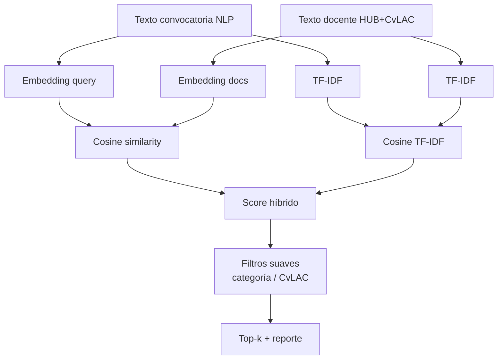

# Decisiones — Match docente ↔ convocatoria (José)

Fecha: 2026-07-25  
Espacio: `laboratorio/jose/matching/`

---

## Pregunta

¿Cómo rankear profesores de Rosario más aptos para una convocatoria Minciencias?

---

## Opciones evaluadas (investigación)

| Opción | Pros | Contras | Decisión |
|--------|------|---------|----------|
| **TF-IDF + cosine (sklearn)** | Cero costo, local, interpretable, ya instalado | No captura sinónimos (“IA” vs “inteligencia artificial”) | **Baseline obligatorio** |
| **Embeddings locales (`sentence-transformers` + E5 multilingual)** | Bueno en español, offline | Requiere `torch` (~GB), no instalado hoy | Diferido |
| **Embeddings vía OpenRouter** (`openai/text-embedding-3-small`) | API unificada, buena calidad multilingüe, ya tenemos key | Costo/red; hay que cachear | **Motor principal del piloto** |
| **Solo LLM ranking** | Explicable | Caro, lento, no escala a 600 docentes | Solo para top-k final (futuro) |
| **BM25 puro** | Clásico IR | Similar a TF-IDF aquí; sklearn basta | No priorizar |

Fuentes consultadas: docs OpenRouter Embeddings; HuggingFace `multilingual-e5-small` / variantes ES; prácticas STS en español.

---

## Decisión de diseño

**Score híbrido (piloto):**

\[
score = 0.7 \cdot cos_{emb} + 0.3 \cdot cos_{tfidf}
\]

Más un **boost** pequeño (+0.02 a +0.05) si:

- tiene bloque `cvlac`
- categoría Minciencias presente (Junior/Asociado/Senior/Emérito)

Motivo: embeddings capturan semántica; TF-IDF ancla términos literales de TdR; boost no reemplaza elegibilidad institucional.

---

## Qué texto se embeddea

### Convocatoria (query)

- objetivo NLP  
- líneas temáticas (nombres)  
- hasta 8 requisitos (texto)  
- hasta 6 criterios (nombre)

### Docente (documento)

- nombre, facultad, cargo  
- áreas HUB  
- perfil profesional (recortado)  
- líneas / áreas CvLAC  
- títulos de proyectos (recortados)  
- categoría Minciencias si existe  

No se embeddean las 300 publicaciones completas (ruido + tokens).

---

## Alcance del piloto

- Convocatorias NLP: **45, 48, 976**
- Docentes: todos los JSON con texto útil; cache de embeddings en `salidas/matching/`
- Escritura **solo** en `laboratorio/jose/salidas/` (gitignored)

---

## Qué NO resuelve este match

- Elegibilidad institucional (alianza, sede regional, grupos A1) → capa aparte ya existente  
- “Equipo suficiente” formal → siguiente iteración (cobertura multi-perfil)  
- GrupLAC categoría de grupo → dato faltante  

---

## Resultado del piloto (2026-07-25)

- Pool: **612** docentes con texto usable.
- Modelo embeddings: `openai/text-embedding-3-small` vía OpenRouter.
- Overlap top-3 TF-IDF vs híbrido (prueba n=80, conv 48): **1/3** → embeddings sí cambian el ranking (no son redundantes).
- Rankings guardados en `salidas/matching/ranking_convocatoria_{45,48,976}.csv`.

### Observaciones cualitativas

- Conv **45** (centros/capacidades): aparecen perfiles de administración/ingeniería con producción en gestión CTeI.
- Conv **48** (biodiversidad/SGR): suben perfiles con señales ambientales/territoriales; TF-IDF aporta términos literales.
- Conv **976** (IA/cuántica): sube score emb; conviene validar a mano si el top es temáticamente IA (riesgo de “investigadores prolíficos” genéricos).

Mitigación futura: penalizar perfiles sin keywords del eje temático; o segundo paso LLM solo sobre top-20.
